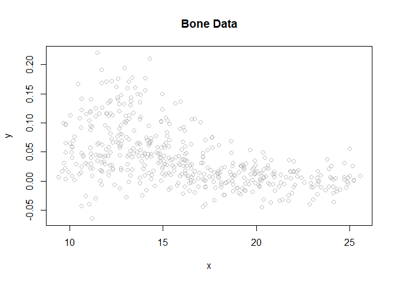
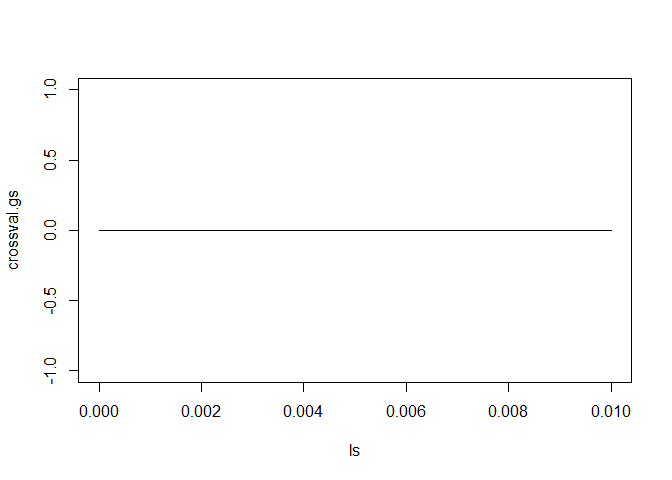
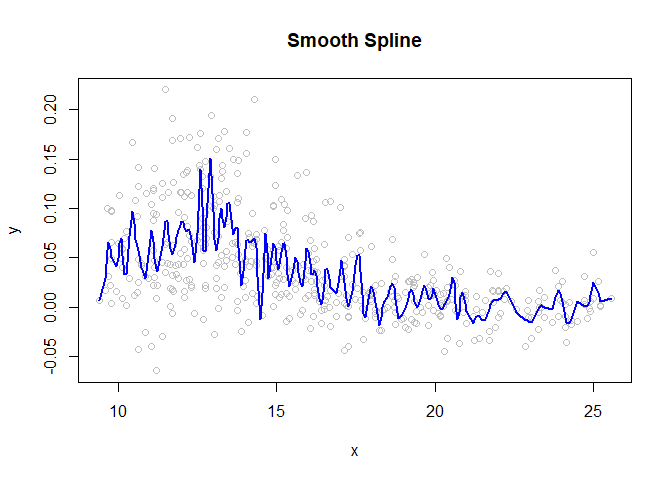
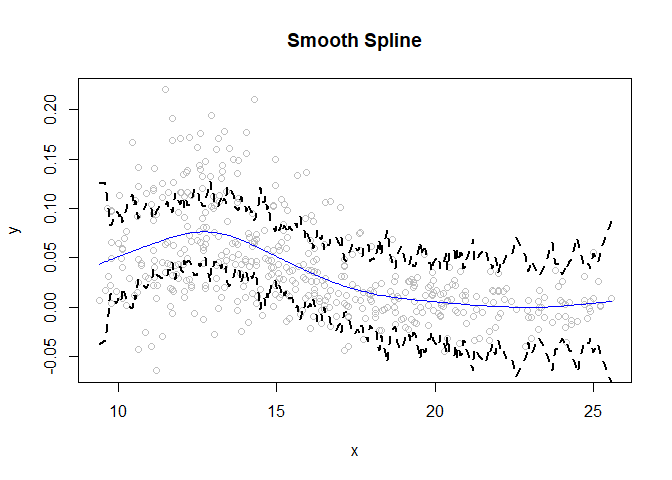
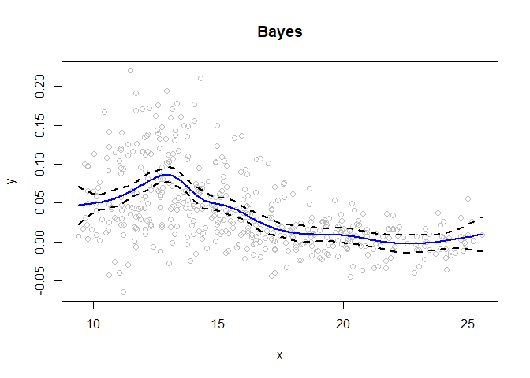
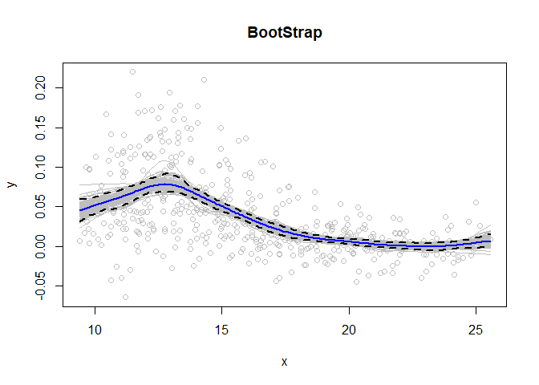

Machine Learning Analysis on Bone Density
================
Samuel Greeman

Our first order of business is to read in the bone data, along with
plotting the variables of interest, age and spine density.
<!-- -->
There appears to be a negative relation between our x variable, age, and
our y variable, spinal density. With the introductory procedures out of
the way, we can now move into part a, which tasks us with fitting a
cubic smoothing spline to the data.

## Part A

<!-- -->

    ## [1] 0

We set our initial lambda value equal to 0.01, but we want to use the
Generalized Cross Validation method to verify what the optimal value of
lambda should be. This is important, as our lambda value determines how
frequently the smoothing occurs throughout our data. To do this, we use
the r function smooth.spline with our initial lambda value of 0.01. We
can get the value for lambda from the graph here by seeing at what value
of ls does our line hit a minimum value. Since we can’t really tell with
our eyes since the graph looks pretty flat, we find the lambda value
using R, which is 0.0074. This is very close to 0.01, but slightly
lower.

<!-- -->
Here, we plot the spline that we get from our lambda value of 0.0074,
and at this point, it is worth noting that we could have used different
cross validation methods such as the Leave One Out method or the K-fold
method, and while all 3 methods will give different lambdas, the line on
the graph you see here will change only marginally. So now that we have
a lambda value, and our smoothing spline, we now need to create our
confidence bands.

<!-- -->
First, we need to find the function f.pred which gives all of the fitted
values of y obtained from our spline model. Using this, we can get the
variance of f.pred from the relationship: V(f) = S_lambda V(y) S_lambda
T and to get S_lambda, we first create the Y.diag.mat which is a 485 x
485 diagonal matrix with 1’s on the main diagonal. Then, we use our
smoothing spline to predict the columns of y, and those columns of y
make up our S_lambda matrix, which we call ls2. Then, we simply
calculate the variance of f, from which we can obtain the standard error
of f, and then using our spline to predict the y values again along with
the critical z values at 0.05 and 0.95 of +\_ 1.64485, we can obtain the
confidence band in the same way you would calculate a confidence
interval, and the above graph shows it.

## Part B

For part b, we are to now find the posterior mean and covariance of our
function. The equations are from 8.28 in the book.

To start, we sort our (unique) x values so that we can identify our
knots for our basis functions. We chose our knots to be at the smallest
value, the 10th percentile value, 20th percentile, 30th, and all the way
up to the 90th percentile value for a total of 10 knots. Our basis, H,
will be made up of natural splines, with fixed knots at the points we
discussed. Our model is obviously linear using our basis H, from which
we can obtain o.hat, which is the variance of the model. We chose a
medium value of tau, 1, based on the suggestion from discussion. We
define x.new here, which is equivalent to our x.u that we created. We
then use these x values to obtain our natural spline of basis functions
(hx) with our fixed knots. We used the identity matrix as our prior
covariance matrix, which is represented by o. From there, we can use the
equations given in 8.28 to obtain the posterior mean, u.p and the
posterior covariance matrix, var.p. With that completed, we now use
those values the same way we did in part a to compute confidence bands,
this time however, we compute Bayesian confidence bands, using the
posterior mean and covariance. Our code in R calculates o.p, which acts
as our standard error for the Bayesian confidence bands.

<!-- -->
As you can see, when we use the Bayes method with the posterior mean and
covariance, we get a spline that is not as smooth. We can see that the
confidence bands grow very wide at the extreme age values, like 10 and
25, much wider than in part a. We can also see that the slope/peak at
around age 13 is much sharper and steeper using the Bayes method, and we
can see also in the Bayes plot that the line is more erratic and bumpy
from ages 15-24 compared to the smooth decline in our smoothing splines
plot.

## Part C

<!-- -->
To start, we assign the number 100 to the variable bootstrap.n, as we
are creating 100 samples using the bootstrap method. Next we create a
485 x 100 matrix full of zeroes, which we will soon fill with relevant
values. The function we use to create these samples is
resample_bootstrap that will give us 100 samples of random values that
are in the bone data. Since we are repeating 100 samples, R will give us
a bunch of warnings telling us not to repeat the sample, so we use the
suppressWarnings function to not show these. The function populates our
y.boot.init matrix with 100 columns (100 bootstrap samples). From this
matrix, we take the mean of each row, and this vector of row means,
y.bs, will be our line on the plot that represents our model from the
100 bootstrap samples we created. We construct the error bars by simply
using the 5th largest and 5th smallest bootstrap samples, in other
words, our 5th percentile and our 95th percentile. Another way to
simplify this is if we could see all 100 individual lines on this plot
(which is hard to see in the graph since they are all so close
together), the 5th line from the top and 5th line from the bottom would
be our confidence bands.

## Part D

    ## [1] 0.002239606

``` r
l.bs <- crossval.total/100
f.pred.bs <- smooth.spline(x, y.bs, lambda=l.bs, cv=T)
```

    ## Warning in smooth.spline(x, y.bs, lambda = l.bs, cv = T): cross-validation with
    ## non-unique 'x' values seems doubtful

``` r
f.pred.bs$cv.crit
```

    ## [1] 0.0007970405

We calculated the cross-validation error for part a in R, and the CV
error estimate is 0.00167, which is relatively small. The last 3 lines
of R codegive us the CV error for the bootstrap/bagging and this is
accomplished by including a line in the code in part c that keeps a
running count of the sum of the lambdas from the bootstrap samples and
then we can calculate the mean value of lambda from the 100 bootstrap
samples. The CV error for this is 0.0008, which is less than half of the
error we calculated for part a. This is likely due to the fact that for
any test in statistics, error and variance will typically go down as we
increase the number of data points, or in this case, the number of
samples increase.
