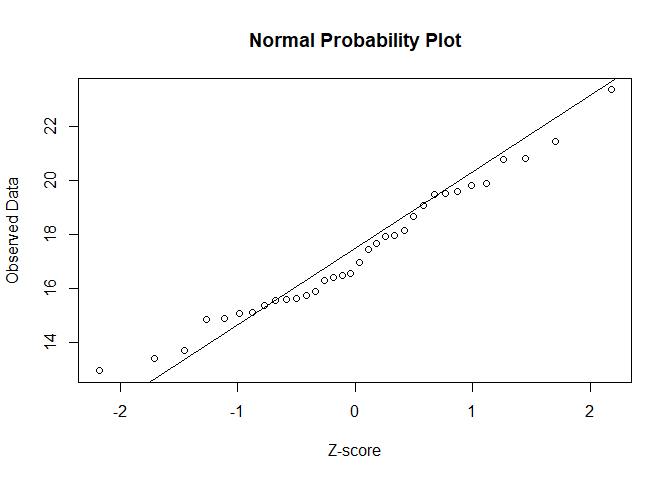
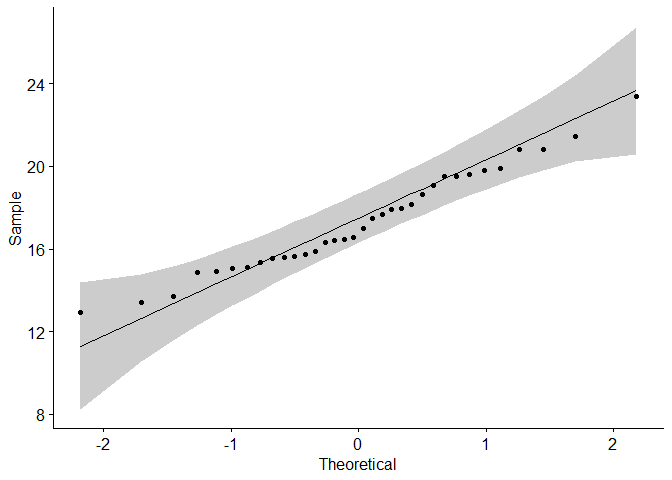
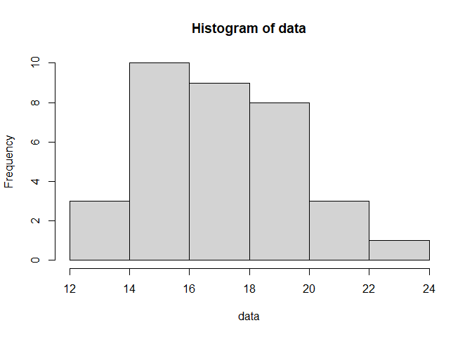

Example 1
================
Samuel Greeman
11/13/2020

Our first example involves a data set of size n = 34 with population
mean 17.21 and population standard deviation of 2.65. We will use all of
our tests to see if our data set comes from a normal distribution. \##
Normal Probability Plot

``` r
data <- c(16.31, 18.66, 18.15, 17.47, 16.97, 16.42, 20.84, 15.59, 13.40, 16.56, 15.11, 
19.89, 23.37, 15.89, 17.96, 14.90, 17.69, 19.53, 15.64, 15.56, 15.74, 14.87, 17.93, 
20.80, 19.82, 19.62, 21.45, 19.50, 16.47, 15.08, 15.36, 12.95, 13.71, 19.08)
qqnorm(data, xlab="Z-score", ylab="Observed Data", main="Normal Probability Plot") 
qqline(data)
```

<!-- -->
We can see from this plot that our sample observations are linearly
related with the theoretical Z-scores, but to make it more clear,
consider this plot:

``` r
library(ggpubr)
```

    ## Loading required package: ggplot2

``` r
ggqqplot(data)
```

<!-- -->
This is the same plot except there is a cone surrounding a general area
around the line. This is to help us see that all of our observations are
within the ‘cone of certainty’ that gets wider as we stray further away
from the mean, meaning this sample looks to be a sample from a normal
distribution.

Next, we will look at a histogram: \## Histogram

``` r
hist(data)
```

<!-- -->
Unlike the previous plots, this histogram is not as clearly
normal-looking. Sure, there are more observations closer to the mean,
but it’s not as clear-cut. If I were to look at just this plot, I may
not be convinced that this sample is from a normal distribution.

Moving onto the tests, we will start with the Shapiro-Wilk Test, which R
will run and give us the test statistic and its p-value. \##
Shapiro-Wilk Test

``` r
shapiro.test(data)
```

    ## 
    ##  Shapiro-Wilk normality test
    ## 
    ## data:  data
    ## W = 0.9725, p-value = 0.5336

Our test statistic, W, is 0.9725, which is correspondent to a p-value of
0.5336. For this test, the null hypothesis is that our sample does
indeed come from a normal distribution, so we would need a p-value less
than, say, 0.05 if we wanted to reject the null hypothesis, so normality
passes this test.

On to the Anderson-Darling Test, where we will hopefully get the same
results. \## Anderson-Darling Test

``` r
library(nortest)
ad.test(data)
```

    ## 
    ##  Anderson-Darling normality test
    ## 
    ## data:  data
    ## A = 0.3736, p-value = 0.398

Our test statistic A = 0.3736 carries with it a similarly high p-value
of 0.398, which is again not close to small enough to consider rejecting
the null hypothesis of normality.

Our final test is the Jarque-Bera Test. \## Jarque-Bera Test

``` r
library(tseries)
```

    ## Registered S3 method overwritten by 'quantmod':
    ##   method            from
    ##   as.zoo.data.frame zoo

``` r
jarque.bera.test(data)
```

    ## 
    ##  Jarque Bera Test
    ## 
    ## data:  data
    ## X-squared = 1.1271, df = 2, p-value = 0.5692

The test statistic for the Jarque-Bera Test is basically a chi-squared
test statistic, and as we can see, the test statistic, 1.1271 only has a
p-value of 0.5692 with 2 degrees of freedom, once again telling us there
is no evidence of a departure from normality.

From these tests and plots, we got 4 definitive, supportive results of
normality, and just 1 neutral result. This lets us say that it is very
likely that the sample that we have follows a normal distribution.
