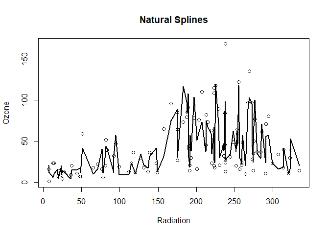
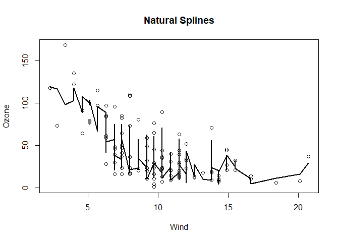

Using Regression Splines and Knots to Model Ozone Data
================
Samuel Greeman

## Part A

``` r
get.knots <- function(x, basis.knots=c(0.25, 0.5, 0.75)){
  return(quantile(x, probs=basis.knots))
}
get.basis <- function(x, knots, intercept.index = FALSE){
  basis <- t(apply(matrix(x, ncol=1), 1, function(x){(x - knots)*((x - knots)>0)}))
  basis <- cbind(x, x^2, x^3, basis^3)
  if(intercept.index){
    basis <- cbind(1, basis)
  }
  return(basis)
}
get.range <- function(x){
  return(seq(min(x), max(x), 1))
}
```

Included in the R code above is the function we used that will generate
knots based on our input at the 25th percentile, 50th percentile, and
75th percentile of the data.Similarly, the basis function will get the a
basis for our data based on our knots, and it will be made up of
polynomials in the 1st, 2nd and 3rd degree, as well as cubic splines
generated at the knots we created in the previous part. We have the
intercept vector of 1’s not included since it causes the predictors in
our basis functions to be linear combinations of each other. By removing
the vector of 1’s, we try to eliminate linear dependence. We then run a
simulation of data that range from the minimum value of our parameters
to the maximum value.

``` r
reg.splines <- function(x, y_in, name){
  data <- data.frame(y=y_in, x=get.basis(x, knots=get.knots(x)))
  x.new <- data.frame(x=get.basis(get.range(x), knots=get.knots(x)))
  b.model <- lm(y ~ ., data=data)
  y_hat <- predict(b.model, newdata=x.new, interval="predict")
  plot(x, y, xlab=name, ylab="Ozone", main="Regression Splines")
  lines(get.range(x), y_hat[,1], lwd=2)
  lines(get.range(x), y_hat[,2], lty=2)
  lines(get.range(x), y_hat[,3], lty=2)
  legend("topleft", legend=c("Fitted Value", "Prediction Interval"), lwd=c(2,1), lty=c(1, 2))
}
```

Now that we have created our functions for getting knots and a basis
from the knots, we can create the splines. The function we use in R will
start by taking x and y_in where y_in is the ozone value in the dataset
and x will be the bases formed from the knots created by our get.knots
function. The new.x corresponds to our get.range function that
effectively simulates data from a given parameter, and this will be used
when we are doing predictive analysis. Our basis.model is just a
standard linear regression model with y being predicted by the given
parameters. To make our prediction interval, we generate a new vector
that holds predicted values, y_predicted. We use the simulated data from
new.x and use our basis.model to predict the ozone values.

<!-- --><!-- --><!-- -->

Here are the plots for each variable individually. Notice how the lines
become unstable toward minimum and maximum x values, something we hope
to remedy in part b and c. However, next we will combine all of our
variables into the same model

``` r
b.model <- lm(ozone ~ get.basis(radiation, knots=get.knots(radiation)) + 
                get.basis(temperature, knots=get.knots(temperature)) + 
                get.basis(wind, knots=get.knots(wind)), data=ozone.data)
y_hat <- predict(b.model)
```

To give a better idea of how well our model works, we make a model (code
seen above) with all three variables to predict ozone. We also generate
a prediction vector to see how well the model performs, and we can see
the results in the plots below.

<!-- --><!-- --><!-- -->

All 3 plots look relatively acceptable, as the only real problems that
we can see are due to extreme outliers. The graph plots the actual
values of the data, with the lines corresponding to the predicted values
for a given value of the variable. As a sidenote, we would have gotten
very similar results if we used the “bs” function to create our basis,
which is for “B-splines”. B-splines are nearly identical in practice to
normal regression splines, except the calculations are slightly
different in the way they deal with larger orders of computation. Still,
our plots would look the same and have the same shape.

## Part B

``` r
nat.splines <- function(x, y_in, name){
  data <- data.frame(y=y_in, x=ns(x, knots=get.knots(x)))
  x.new <- data.frame(x=ns(get.range(x), knots=get.knots(x)))
  b.model <- lm(y ~ ., data=data)
  y_hat <- predict(b.model, newdata=x.new, interval="predict")
  plot(x, y, xlab=name, ylab="Ozone", main="Natural Splines")
  lines(get.range(x), y_hat[,1], lwd=2)
  lines(get.range(x), y_hat[,2], lty=2)
  lines(get.range(x), y_hat[,3], lty=2)
  legend("topleft", legend=c("Fitted Value", "Prediction Interval"), lwd=c(2,1), lty=c(1, 2))
}
```

The code/input and process are relatively similar to part a, but with
some key changes. Natural splines try to eliminate erratic behavior at
boundaries by removing the knots past the boundary (and defining the
model outside the boundaries as linear) in order to become more precise
within the boundary, by adding more knots. Here, however, we still have
the same 3 fixed knots. You will notice that instead of “get.basis”, we
now use “ns” to get the basis for a natural spline. This is due to the
fact that natural splines are created and calculated differently, mainly
in the ways I described. Below are the individual plots for for the
variables using the natural splines:

<!-- --><!-- --><!-- -->

We can see that the wacky and erratic behavior past the boundary is
remedied, as is the goal of natural splines, and it instead represents a
linear function past the boundary which, while may be fractionally less
accurate, it also reminds us that values near and past the boundary are
less common, so we use natural splines to make it more accurate in the
middle while losing a bit of accuracy at the boundaries. As with part a,
we create a model using the code below with all 3 variables, and we
can’t see much of a difference here between natural and regression
splines:

``` r
natural.model <- lm(ozone ~ ns(radiation, knots=get.knots(radiation)) + ns(temperature, 
                    knots=get.knots(temperature))
                    + ns(wind, knots=get.knots(wind)), data=ozone.data)
y_predicted <- predict(natural.model)
```

<!-- --><!-- --><!-- -->

## Part C

For smoothing splines, we need only look at the individual plots for
each variable to show how they work. Smoothing splines mimic natural
splines except they have knots at each individual data point instead of
the fixed knots as we have been doing previously. In addition, smoothing
splines are generated the same way that natural splines are with a
regularization or “smoothing term” lambda that is determined by the
shape of the data. R has a function “smooth.spline” that makes our job
easier, and as we look at the plots, we see that the smoothing splines
model does a great job smoothing out the spikes in the middle of the
data.

<!-- --><!-- --><!-- -->

From all three methods, we can summarize our findings on the effect the
3 variables have on ozone: For radiation, a higher radiation corresponds
to higher ozone concentration. The downslope at the end is likely due to
there not being many data points beyond approximately 280 langleys of
radiation. For temperature, we see a much clearer positive relationship
between temperature and ozone rating, meaning as temperature increases,
so does radiation. Wind has a negative relation with ozone rating. Like
temperature, this relation is very strong, stronger than the relation
between radiation and ozone rating.
